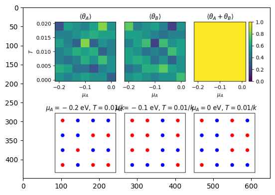
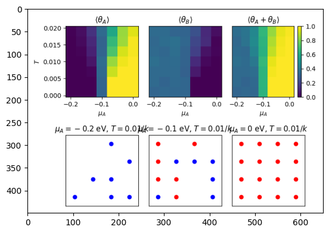
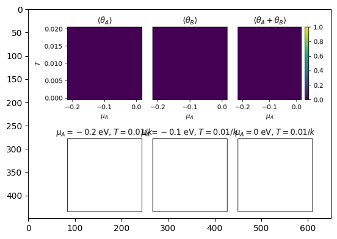
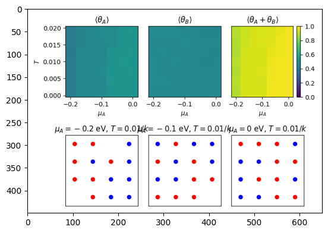

```python
import matplotlib.pyplot as plt
import matplotlib.image as mpimg
img = mpimg.imread('Plots/AttractiveInteractions.png')
imgplot = plt.imshow(img)
plt.show()
```


    

    


This experiment performed really well. Almost regardless of temperature or potential conditions, there was high levels of coverage from both Nitrogen and Hydrogen. In the mean coverage plot, its completely blanketed out, implying the catalyst is performing well at giving active sites for both Nitrogen and Hydrogen to absorb. It's interesting how high levels of potential or temperature start to force either Nitrogen or Hydrogen to take a majority of coverage, to the detriment of the other. From this diagram, it appears as though higher levels of potential and temperature favor Nitrogen. On the other hand, looking at the bottom right corner of the graphs, much lower levels of potential and temperature favor Hydrogen. It's thus probable that we want to take something near the center left of the graphs in order to get a mix of both. It seems like the attractive interactions do a good job of making sure the hydrogen and nitrogen are evenly dispersed and get a mix.


```python
import matplotlib.pyplot as plt
import matplotlib.image as mpimg
img = mpimg.imread('Plots/IdealMixture.png')
imgplot = plt.imshow(img)
plt.show()
```


    

    


This experiment favors hydrogen to a much greater extent. Even at very high levels of potential, Nitrogen does not appear to get much higher than 0.6 coverage whereas at low levels of potential hydrogen will completely dominate which can be seen on the bottom lattice configurations. For this experiment to be successful, you probably would need to keep potential near the -0.1 midpoint. However, it is unfortunate that unlike the previous experiment, you don't get full coverage and some sites remain unfilled. This is probably due to nitrogen "peaking out" and reaching a wall of maximum sites taken, leading to hydrogen taking over some of nitrogen's sites. It's also interesting that the coverage doesn't vary with temperature to the extent it varys with potential implying either that the temperature necessary for the reaction has already been reached before 0 or that potential is just so strong that it negates the effects of temperature.


```python
import matplotlib.pyplot as plt
import matplotlib.image as mpimg
img = mpimg.imread('Plots/Immiscible.png')
imgplot = plt.imshow(img)
plt.show()
```


    

    


It seems like that when the solution is immiscible there is no coverage on the catalyst. This an interesting result. I would have expected it to go fully Nitrogen at low potentials and then go full hydrogen at high potentials as once one of them gets placed they just fully take over. It does make sense that there is limited coverage given that they are so repulsive to each other and it aligns well with the results from the repulsive interaction that if they can't be near each other there is no coverage. You can't optimize this and it's unlikely to be the true paramaters or we would never be able to do the Haber Boche Reaction.


```python
import matplotlib.pyplot as plt
import matplotlib.image as mpimg
img = mpimg.imread('Plots/LikeDissolvesUnlike.png')
imgplot = plt.imshow(img)
plt.show()
```


    

    


This experiment works well. There is a great coverage across the catalyst regardless of voltage and potential which can be seen in the mean coverage plot by yellow across the entire spectrum. The hydrodgen plot does seem to be somewhat affect by potential but its interesting how the nitrogen plot is just a constant shade of one color. Thus the mean coverage plot seems to be most driven by the hydrogen which leads to better coverage at lower potential and higher temperature. This aligns nicely with the lattice plot where it gradually gets more and more filled as the potential decreases, albeit it was already mostly filled at the start. This senerio makes sense given that both the hydrogen and nitrogen are strong enough to stick to themselves but its interesting that it looks almost nothing like the repulsive interactions.


```python
import matplotlib.pyplot as plt
import matplotlib.image as mpimg
img = mpimg.imread('Plots/RepulsiveInteractions.png')
imgplot = plt.imshow(img)
plt.show()
```


    

    


This plot also had nothing. This makes a lot of sense given thatnothing showed up when nitrogen and hydrogen wre immiscible and this is a heightened version of that. Again, it seems challenging to optimize and its unlikely these are the intereaction governing the body.
